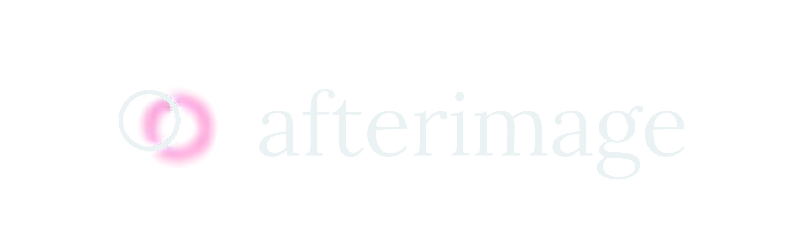

  

  An interactive web tool for generating typography posters and glitch art.

---

### Features
- **Poster Generator**: Turn any word into a visual glitch poster.
- **Customization**: Presets, blur, glitch blocks, glow, and custom colors.
- **Export**: Save your generated poster instantly.

### Tech Stack
- HTML, CSS, JavaScript

---

### License
This project is licensed under the [MIT License](LICENSE).
